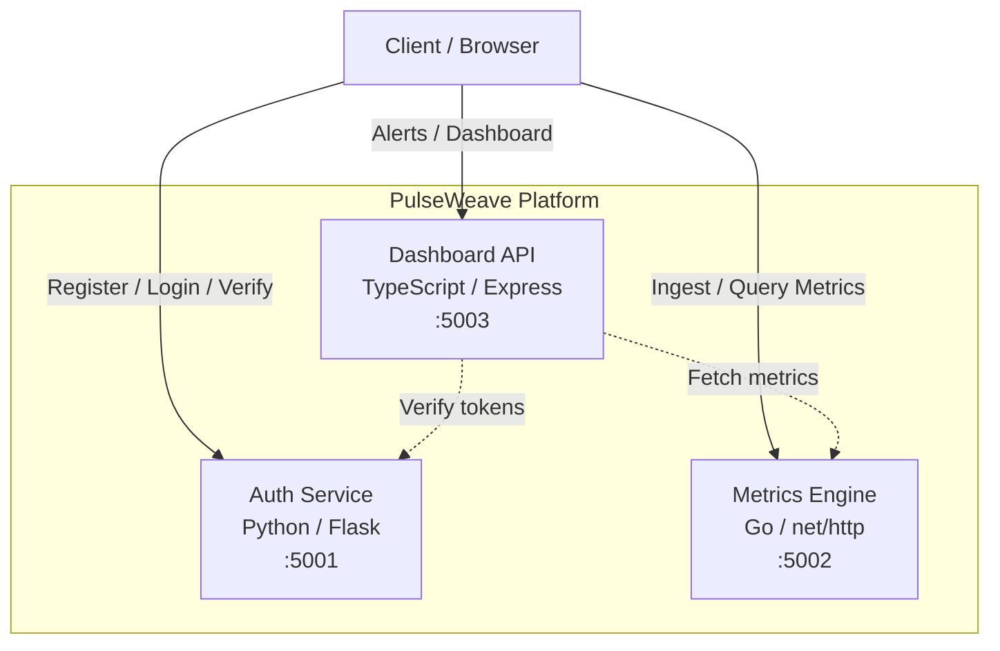

# PulseWeave

A distributed health monitoring and service mesh observability platform built with Python, Go, and TypeScript microservices.

## Architecture



## Services

| Service | Language | Port | Description |
|---------|----------|------|-------------|
| **auth-service** | Python (Flask) | 5001 | User registration, login, and token verification |
| **metrics-engine** | Go (net/http) | 5002 | Metrics ingestion, storage, and query engine |
| **dashboard-api** | TypeScript (Express) | 5003 | Alert management, dashboard summaries, and notifications |

## Quick Start

### Prerequisites

- Docker & Docker Compose
- Python 3.12+
- Go 1.22+
- Node.js 20+

### Using Docker Compose

```bash
cp .env.example .env
make up
```

All services will be available at their respective ports.

### Manual Setup

```bash
# Auth Service (Python)
cd services/auth-service
pip install -r requirements.txt
python app.py

# Metrics Engine (Go)
cd services/metrics-engine
go run main.go

# Dashboard API (TypeScript)
cd services/dashboard-api
npm install
npm run dev
```

## API Reference

### Auth Service (`:5001`)

| Method | Endpoint | Description |
|--------|----------|-------------|
| GET | `/health` | Health check |
| POST | `/register` | Register a new user (`{"username", "password"}`) |
| POST | `/login` | Login and receive a token (`{"username", "password"}`) |
| POST | `/verify` | Verify a token (`{"token"}`) |

### Metrics Engine (`:5002`)

| Method | Endpoint | Description |
|--------|----------|-------------|
| GET | `/health` | Health check |
| POST | `/ingest` | Ingest a metric (`{"service", "name", "value"}`) |
| GET | `/query` | Query metrics (optional `?service=` filter) |

### Dashboard API (`:5003`)

| Method | Endpoint | Description |
|--------|----------|-------------|
| GET | `/health` | Health check |
| GET | `/alerts` | List alerts (optional `?service=` filter) |
| POST | `/alerts` | Create an alert (`{"service", "message", "severity"}`) |
| PATCH | `/alerts/:id/acknowledge` | Acknowledge an alert |
| GET | `/dashboard/summary` | Get dashboard summary |

## Usage Examples

```bash
# Register a user
curl -X POST http://localhost:5001/register \
  -H "Content-Type: application/json" \
  -d '{"username": "admin", "password": "secret"}'

# Login
curl -X POST http://localhost:5001/login \
  -H "Content-Type: application/json" \
  -d '{"username": "admin", "password": "secret"}'

# Ingest a metric
curl -X POST http://localhost:5002/ingest \
  -H "Content-Type: application/json" \
  -d '{"service": "auth-service", "name": "request_count", "value": 42}'

# Query metrics
curl http://localhost:5002/query?service=auth-service

# Create an alert
curl -X POST http://localhost:5003/alerts \
  -H "Content-Type: application/json" \
  -d '{"service": "metrics-engine", "message": "High CPU usage", "severity": "warning"}'

# View dashboard summary
curl http://localhost:5003/dashboard/summary
```

## Testing

```bash
# Run all tests
make test

# Run linters
make lint

# Individual service tests
make test-python
make test-go
make test-ts
```

## Environment Variables

See [`.env.example`](.env.example) for all available configuration options.

| Variable | Default | Description |
|----------|---------|-------------|
| `AUTH_SERVICE_PORT` | `5001` | Port for the auth service |
| `METRICS_ENGINE_PORT` | `5002` | Port for the metrics engine |
| `DASHBOARD_API_PORT` | `5003` | Port for the dashboard API |
| `LOG_LEVEL` | `INFO` | Log level for Python service |

## CI/CD

GitHub Actions workflow runs on push/PR to `main`:
1. Python tests + flake8 lint
2. Go tests + go vet
3. TypeScript tests + ESLint
4. Docker Compose build verification

> **Note:** The `.github/workflows/ci.yml` file may need to be manually added after initial repository setup due to GitHub API restrictions.
